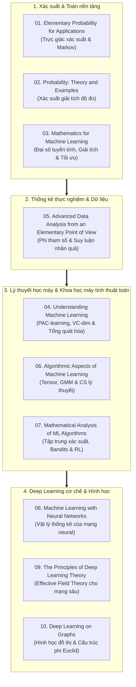

# Curated AI/ML Book Library

Thư viện giám tuyển học thuật về **nền tảng toán học, xác suất lý thuyết, học máy thống kê và lý thuyết deep learning**.

Repository đóng vai trò như một cẩm nang định hướng (study companion): cung cấp metadata chính thức, cấu trúc chương mục xác thực, tóm tắt khái niệm và ma trận liên kết giữa các tác phẩm mà **tuyệt đối không lưu trữ hay phân phối lại tệp sách/PDF**.

---

## 📚 Danh mục bộ sưu tập (Collection Index)

| # | Tác phẩm (Book Title) | Tác giả | Trọng tâm học thuật |
| :-: | :--- | :--- | :--- |
| **01** | [**Elementary Probability for Applications**](books/01-elementary-probability-for-applications.md) | Rick Durrett | Trực giác xác suất & Markov chains |
| **02** | [**Probability: Theory and Examples** (5th Ed.)](books/02-probability-theory-and-examples.md) | Rick Durrett | Xác suất giải tích độ đo & Martingales |
| **03** | [**Mathematics for Machine Learning**](books/03-mathematics-for-machine-learning.md) | M. P. Deisenroth, A. A. Faisal, C. S. Ong | Đại số tuyến tính, Giải tích & 4 trụ cột ML |
| **04** | [**Understanding Machine Learning: From Theory to Algorithms**](books/04-understanding-machine-learning.md) | S. Shalev-Shwartz, S. Ben-David | Lý thuyết học thống kê (PAC, VC, Convex) |
| **05** | [**Advanced Data Analysis from an Elementary Point of View**](books/05-advanced-data-analysis.md) | Cosma Rohilla Shalizi | Hồi quy phi tham số & Suy luận nhân quả |
| **06** | [**Algorithmic Aspects of Machine Learning**](books/06-algorithmic-aspects-of-machine-learning.md) | Ankur Moitra | Thuật toán ML từ góc nhìn CS lý thuyết |
| **07** | [**Mathematical Analysis of Machine Learning Algorithms**](books/07-mathematical-analysis-of-ml-algorithms.md) | Tong Zhang | Bất đẳng thức tập trung & RL Theory |
| **08** | [**Machine Learning with Neural Networks**](books/08-machine-learning-with-neural-networks.md) | Bernhard Mehlig | Vật lý thống kê của mạng neural |
| **09** | [**The Principles of Deep Learning Theory**](books/09-the-principles-of-deep-learning-theory.md) | D. A. Roberts, S. Yaida, B. Hanin | Lý thuyết trường hiệu dụng cho Deep Learning |
| **10** | [**Deep Learning on Graphs**](books/10-deep-learning-on-graphs.md) | Yao Ma, Jiliang Tang | Biểu diễn học & Mạng neural trên đồ thị |

---

## 🗺️ Sơ đồ tri thức (Knowledge Map)

10 tác phẩm được cấu trúc theo 4 tầng tri thức tương hỗ:

---

### 📄 Copyright

This repository is a curated educational resource. Original content is provided for informational and educational purposes.

Books and other third-party materials remain the property of their respective authors, publishers, or copyright holders. This repository does not host or redistribute them.

External links are provided for reference and point to their respective official or authorized sources.
